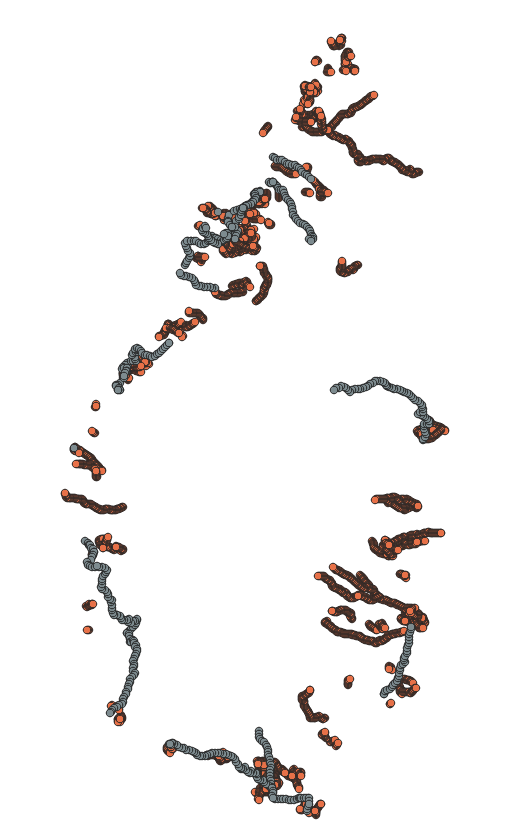
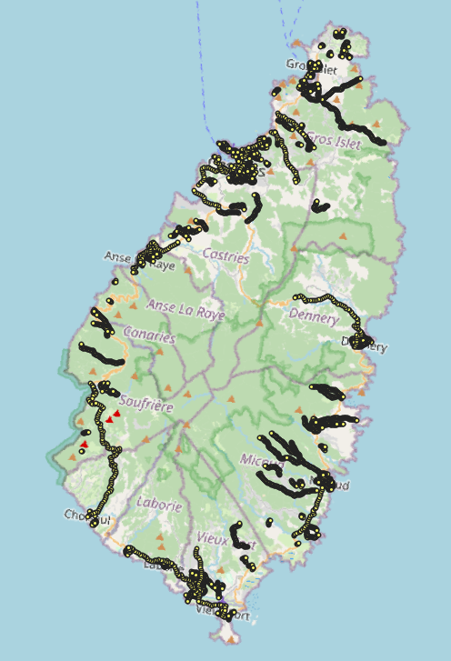

# SAFStreetLight Function

## Function Overview

The `SAFStreetLight` function processes streetlight vector data to create a raster representation of safety scores based on streetlight coverage.

## Key Components

### Constants
- `LIGHT_AREA_RADIUS`: 20 meters
- `SCORE_BINS`: [0, 1, 20, 40, 60, 80, 100]
- `SCORES`: [0, 0, 1, 2, 3, 4, 5]

### Main Steps
1. Setup: Initialize directories and paths
2. Input Processing: Load and reproject vector layer if necessary
3. Buffering: Create 20-meter buffers around streetlight points
4. Rasterization: Convert buffered vector to raster
5. Coverage Calculation: Use convolution for streetlight coverage
6. Score Assignment: Assign safety scores based on coverage percentage
7. Output: Save resulting raster and clean up

## Caller Relationship

Called by `SAFnightTimeLights` when input is a vector layer:

```python
def SAFnightTimeLights(self):
    # ... (earlier code)
    if input_layer.isValid():
        # Handle raster input
    else:
        # Handle vector input (assumed to be streetlights)
        self.SAFstreetLights()
```

## Technical Details

### Buffering
Uses QGIS processing tool "native:buffer" with parameters:
- Distance: 20 meters
- Segments: 8
- End cap style: 0
- Join style: 0
- Miter limit: 2
- Dissolve: False

### Rasterization
Uses GDAL rasterize with parameters:
- Burn value: 1
- No data value: 0

### Coverage Calculation
Employs a convolution operation:
1. Create circular kernel
2. Slide kernel over rasterized data
3. Calculate coverage percentage

### Score Assignment
Uses numpy operations:
1. Digitize coverage percentage into bins
2. Map bin indices to scores

## Future Development Considerations

1. Input Validation: Ensure vector layer contains point geometries
2. Parameterization: Make light area radius and scoring system configurable
3. Performance Optimization: Investigate parallel processing for convolution
4. Multi-band Support: Extend for multi-band data if needed

[Previous content remains unchanged]

## Substitute Streetlights Data Generation

Due to the unavailability of actual streetlight location data in the sample dataset and limited time for sourcing, a method was devised to generate substitute data based on available road network information.

### Data Source and Preprocessing

The primary data source was the roads shapefile for the area of interest. A subset of roads was extracted based on the following criteria:
1. 'Residential' roads from the 'highways' category
2. 'Tertiary', 'Secondary', and 'Primary' roads, which were merged into a single category of major roads

This extraction process provided a foundation for estimating streetlight distributions.


### Residential Streetlight Generation

For residential roads, points were scattered along the geometry at 50-meter intervals. This interval was chosen to approximate the typical spacing of streetlights in residential areas.


### Major Road Streetlight Generation

The process for major roads involved additional steps:
1. The merged major roads were filtered based on segment lengths to exclude longer cross-country roads that typically have less frequent lighting.
2. Points were then scattered along the remaining geometry at 150-meter intervals, reflecting the generally wider spacing of streetlights on major roads compared to residential areas.


### Resulting Distribution

This methodology produces a calculated estimation of light source distribution for development purposes. The resulting point dataset approximates streetlight locations based on road type and typical lighting patterns.



The final distribution provides a reasonable proxy for actual streetlight locations, allowing for the development and testing of the SAFStreetLight function in the absence of real-world data.


